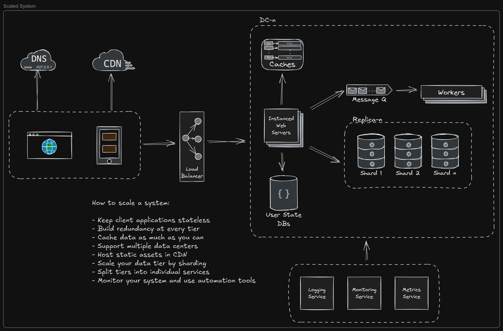

# Software Diagrams

This is a collection of various process, system, use-case, etc. diagrams related to Software Engineering that I have created and/or use often. I am still figuring out the best way to present these, so current presentation might feel a bit "funky."

Here's an example of a typical approach to scaling out an application system:

